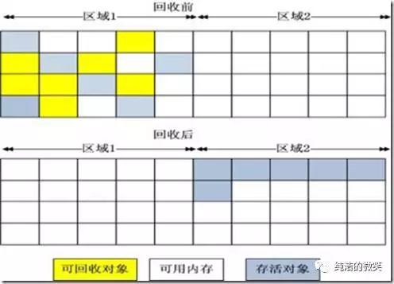
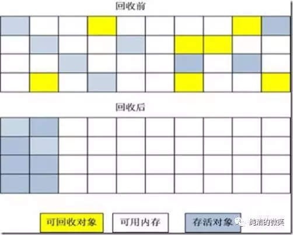
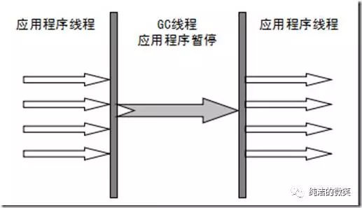

## 概述
垃圾收集 Garbage Collection 通常被称为“GC”，它诞生于1960年 MIT 的 Lisp 语言，经过半个多世纪，目前已经十分成熟了。 jvm 中，程序计数器、虚拟机栈、本地方法栈都是随线程而生随线程而灭，栈帧随着方法的进入和退出做入栈和出栈操作，实现了自动的内存清理，因此，我们的内存垃圾回收主要集中于 java 堆和方法区中，在程序运行期间，这部分内存的分配和使用都是动态的.

## 对象存活判断
判断对象是否存活一般有两种方式：

 __引用计数：__ 每个对象有一个引用计数属性，新增一个引用时计数加1，引用释放时计数减1，计数为0时可以回收。此方法简单，无法解决对象相互循环引用的问题。
 
 __可达性分析__  （Reachability Analysis）：从GC Roots开始向下搜索，搜索所走过的路径称为引用链。当一个对象到GC Roots没有任何引用链相连时，则证明此对象是不可用的。不可达对象。

在Java语言中，GC Roots包括：
* 虚拟机栈中引用的对象。
* 方法区中类静态属性实体引用的对象。
* 方法区中常量引用的对象。
* 本地方法栈中JNI引用的对象。

## 垃圾收集算法
### 标记 -清除算法
“标记-清除”（Mark-Sweep）算法，如它的名字一样，算法分为“标记”和“清除”两个阶段：首先标记出所有需要回收的对象，在标记完成后统一回收掉所有被标记的对象。之所以说它是最基础的收集算法，是因为后续的收集算法都是基于这种思路并对其缺点进行改进而得到的。

它的主要缺点有两个：一个是效率问题，标记和清除过程的效率都不高；另外一个是空间问题，标记清除之后会产生大量不连续的内存碎片，空间碎片太多可能会导致，当程序在以后的运行过程中需要分配较大对象时无法找到足够的连续内存而不得不提前触发另一次垃圾收集动作。

### 复制算法
“复制”（Copying）的收集算法，它将可用内存按容量划分为大小相等的两块，每次只使用其中的一块。当这一块的内存用完了，就将还存活着的对象复制到另外一块上面，然后再把已使用过的内存空间一次清理掉。

这样使得每次都是对其中的一块进行内存回收，内存分配时也就不用考虑内存碎片等复杂情况，只要移动堆顶指针，按顺序分配内存即可，实现简单，运行高效。只是这种算法的代价是将内存缩小为原来的一半，持续复制长生存期的对象则导致效率降低。

### 标记-压缩算法
复制收集算法在对象存活率较高时就要执行较多的复制操作，效率将会变低。更关键的是，如果不想浪费50%的空间，就需要有额外的空间进行分配担保，以应对被使用的内存中所有对象都100%存活的极端情况，所以在老年代一般不能直接选用这种算法。

根据老年代的特点，有人提出了另外一种“标记-整理”（Mark-Compact）算法，标记过程仍然与“标记-清除”算法一样，但后续步骤不是直接对可回收对象进行清理，而是让所有存活的对象都向一端移动，然后直接清理掉端边界以外的内存

 
 
 ### 分代收集算法
 
GC分代的基本假设：绝大部分对象的生命周期都非常短暂，存活时间短。

“分代收集”（Generational Collection）算法，把Java堆分为新生代和老年代，这样就可以根据各个年代的特点采用最适当的收集算法。在新生代中，每次垃圾收集时都发现有大批对象死去，只有少量存活，那就选用复制算法，只需要付出少量存活对象的复制成本就可以完成收集。而老年代中因为对象存活率高、没有额外空间对它进行分配担保，就必须使用“标记-清理”或“标记-整理”算法来进行回收。

## 垃圾收集器
 __`如果说收集算法是内存回收的方法论，垃圾收集器就是内存回收的具体实现`

### Serial收集器
串行收集器是最古老，最稳定以及效率高的收集器，可能会产生较长的停顿，只使用一个线程去回收。新生代、老年代使用串行回收；新生代复制算法、老年代标记-压缩； __垃圾收集的过程中会Stop The World（服务暂停）

`参数控制： -XX:+UseSerialGC 串行收集器`

 
 
 ### ParNew收集器
 ParNew收集器其实就是Serial收集器的多线程版本。新生代并行，老年代串行；新生代复制算法、老年代标记-压缩

参数控制：

  * -XX:+UseParNewGC ParNew收集器
  * -XX:ParallelGCThreads 限制线程数量

 

